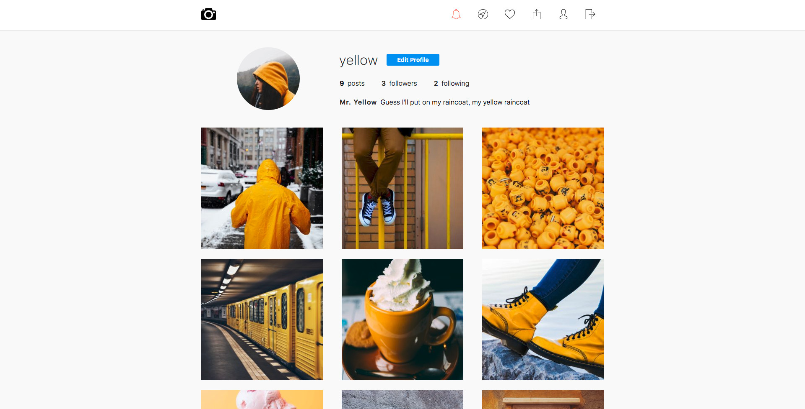
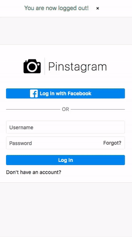

# Pinstagram

Pinstagram is a full stack Instagram clone. It's the result of exercising with Node, MongoDB and its frameworks.
The goal was to build a functional clone of some Internet-based photo-sharing application.

I finally decided to copy the web version of Instagram and add some extra features to it, such as the ability to upload images in the browser or to be able to see all the images that I liked in one place, such as the Pinterest boards.

This is my first approach to the Back-end kingdom.

## The stack
- **Server side**: Node with Express (ES2017 async/await)
- **Database**: MongoDB and Mongoose
- **Templates**: Pug (formerly Jade)
- **Authentication**: Passport.js
- **Client side**: ES6 vanilla Javascript and Sass

## Live App
Create an account [here](https://pinstagram.axelfuhrmann.com) or browse other users' feeds:
- [Red](https://pinstagram.axelfuhrmann.com/red)
- [Yellow](https://pinstagram.axelfuhrmann.com/yellow)
- [Purple](https://pinstagram.axelfuhrmann.com/purple)
- [Blue](https://pinstagram.axelfuhrmann.com/blue)

You can also login in with one of the following **empty profiles**:

|username|password|
|---|---|
|guest1|123|
|guest2|123|

## Features
**As an unauthenticated user**:
- I can create a new account.
- I can reset my password via email if I already have an account.
- I can browse other users' feed.

**As authenticated user**:
- I can edit my profile info, change my avatar and password.
- I can follow other users.
- I have a Home page showing all of my friends' recent images.
- I will receive a notification when a user starts to follow me, likes or comments one of my photos.
- I can share an image with a caption.
- I can comment and like/unlike an image. My liked images will be stored in my Likes page.
- I can delete any of my images or comments.
- I can discover other users via suggestions.

---
While the priority of this exercise isn't mobile apps, it works quite well on Android with Chrome (not tested on any other phone)

---

#### TODO
- Hashtags
- Linking users (\@username)
- Socket.io
